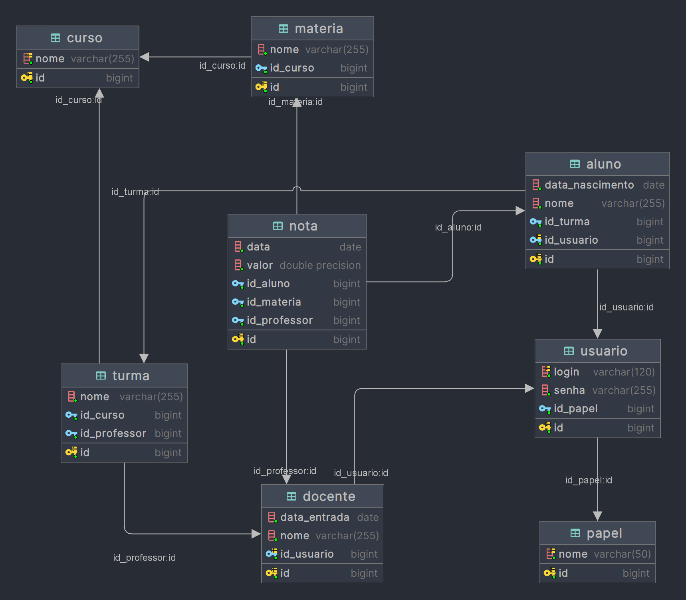

# LabPCP: API Rest para Gestão Educacional

## Introdução

Este é o projeto avaliativo do módulo de Backend do curso Fullstack, da turma Education do Floripa Mais Tec.
O objetivo do projeto é desenvolver uma API Rest completa voltada para a gestão de cursos, turmas, conteúdos e docentes,
que será futuramente integrada às soluções web de gestão em escolas e creches da rede pública.
O projeto possui alguns requisitos:
1. Criar uma API Rest back-end desenvolvida em Java.
2. Ser construída utilizando o framework Spring Boot:
    - Utilizar a estrutura Controller, Service e Repository.
    - Adicionar controle de segurança com Spring Security.
    - As requisições e respostas devem ter classes DTO.
3. Utilizar o PostgreSQL para guardar as informações cadastradas.
4. Utilizar o GitHub como versionador de código:
    - Utilização do padrão baseado em GitFlow com main, features e releases.
    - Utilização de commits curtos e concisos.
5. Utilizar Trello para organização das tarefas a serem realizadas.

## Tecnologias Utilizadas

- Java
- Spring
- PostgreSQL
- Docker

## Ferramentas Utilizadas

- IntelliJ IDEA
- Postman
- Trello
- GitHub

## Pré-Requisitos

- JDK 17 ou superior instalado
- IntelliJ IDEA
- Git instalado na máquina
- Docker
- Docker Compose

## Dependências

1. **Spring Boot Starter for Spring Data JPA:**
    - GroupId: org.springframework.boot
    - ArtifactId: spring-boot-starter-data-jpa

2. **Spring Boot Starter for Spring OAuth2 Resource Server:**
    - GroupId: org.springframework.boot
    - ArtifactId: spring-boot-starter-oauth2-resource-server

3. **Spring Boot Starter for Spring Security:**
    - GroupId: org.springframework.boot
    - ArtifactId: spring-boot-starter-security

4. **Spring Boot Starter for Spring Web:**
    - GroupId: org.springframework.boot
    - ArtifactId: spring-boot-starter-web

5. **Spring Boot DevTools:**
    - GroupId: org.springframework.boot
    - ArtifactId: spring-boot-devtools

6. **PostgreSQL Driver:**
    - GroupId: org.postgresql
    - ArtifactId: postgresql

7. **Project Lombok:**
    - GroupId: org.projectlombok
    - ArtifactId: lombok

8. **Spring Boot Starter for Testing:**
    - GroupId: org.springframework.boot
    - ArtifactId: spring-boot-starter-test

9. **Spring Security Testing:**
    - GroupId: org.springframework.security
    - ArtifactId: spring-security-test

10. **SpringDoc OpenAPI Starter for Spring Web MVC UI (Version 2.4.0):**
    - GroupId: org.springdoc
    - ArtifactId: springdoc-openapi-starter-webmvc-ui
    - Version: 2.4.0

## Entidades do Banco de Dados



### Entidade Papel:

- **id (int):** O identificador único do papel.
- **nome (String):** O nome do papel.

### Entidade Usuário:

- **id (int):** O identificador único do usuário.
- **login (String):** O nome de usuário para login.
- **senha (String):** A senha do usuário para autenticação.
- **id_papel (Papel):** O papel ou função do usuário no sistema.

### Entidade Docente:

- **id (int):** O identificador único do docente.
- **nome (String):** O nome completo do docente.
- **data_entrada (Date):** Data de entrada do docente na empresa.
- **id_usuario (int):** O identificador do usuário, deve ser único.

### Entidade Turma:

- **id (int):** O identificador único da turma.
- **nome (String):** O nome ou identificador da turma.
- **professor (Docente):** O docente responsável pela turma.
- **id_curso (int):** O curso ao qual a turma está relacionada.

### Entidade Aluno:

- **id (int):** O identificador único do aluno.
- **nome (String):** O nome completo do aluno.
- **data_nascimento (Data):** Data de nascimento do aluno.
- **id_usuario (int):** O identificador do usuário, deve ser único.
- **id_turma (int):** A turma em que o aluno está inscrito.

### Entidade Curso:

- **id (int):** O identificador único do curso.
- **nome (String):** O nome do curso, deve ser único.

### Entidade Matéria:

- **id (identificador único da matéria):** O identificador único da matéria.
- **nome (nome da matéria):** O nome da matéria.
- **id_curso (int):** O curso ao qual a matéria está relacionada.

### Entidade Nota:

- **id (identificador único da nota):** O identificador único da nota.
- **id_aluno (identificador do aluno ao qual a nota está associada):** Identificador do aluno ao qual a nota está associada.
- **id_professor (identificador do professor que atribuiu a nota):** Identificador do professor que atribuiu a nota.
- **id_materia (identificador da matéria à qual a nota pertence):** Identificador da matéria à qual a nota pertence.
- **valor (valor da nota):** Valor da nota.
- **data (data em que a nota foi atribuída):** Data em que a nota foi atribuída.

## Regras de Negócio

1. Utilizar os seguintes papéis do usuário:
    - **ADM (Entidade Docente)**: que pode acessar tudo.
    - **PEDAGOGICO (Entidade Docente)**: que pode acessar tudo sobre turma, curso e professor, aluno, menos deletar dados.
    - **RECRUITER (Entidade Docente)**: que pode acessar tudo sobre professor, menos deletar dados.
    - **PROFESSOR (Entidade Docente)**: que pode acessar tudo sobre notas, menos deletar dados.
    - **ALUNO (Entidade Aluno)**: que apenas acessa as suas próprias notas e a pontuação total pessoal, menos deletar dados.
2. Seguir as seguintes regras de negócio:
    - Só o ADM pode deletar entidades.
    - Só o ADM pode criar usuários (realizar cadastros)
    - Os logs são pré-requisitos, sendo um log para cada erro e pelo menos um log para cada método executado.
    - A API deverá gerar a pontuação total de um aluno, a pontuação é dada pela seguinte lógica: soma das notas, dividido pelo número de matérias, multiplicado por 10.

## Como Começar

### Instalação - Clonando o Repositório

```
git clone https://github.com/scheiladev/senai-fullstack-education-projeto-final-modulo01.git
````

### Inicializando o Banco de Dados

```
docker-compose up -d
```

### Execução

Abra o projeto no IntelliJ IDEA e execute-o usando o atalho de execução da IDE.

## Documentação da API

A seguir estão especificados os endpoints da aplicação. Todos os endpoints, com exceção do endpoint de Login,
recebem um Token JWT que controla o acesso aos dados do mesmo.

### Portas Utilizadas

- Banco de dados: 5438
- URL Servidor: http://localhost:8088

## Endpoints

### Endpoint de Login

- **Login de Usuário (POST /login)**
   - **Descrição:** Permite que um usuário faça login no sistema.
   - **Body:** JSON contendo as credenciais do usuário (usuario e senha).
   - **Respostas Possíveis:**
     - Código 200 (OK) - Login bem-sucedido. Retorna um token JWT (JSON Web Token) no corpo da resposta.
     - Código 401 (Unauthorized) - Credenciais inválidas. O usuário não está autorizado a acessar o sistema.
     - Código 400 (Bad Request) - Requisição inválida, por exemplo, dados ausentes ou incorretos.

### Endpoint de Cadastro

- **Cadastro de Usuário (POST /cadastro)**
   - **Descrição:** Permite que um novo usuário seja cadastrado no sistema.
   - **Body:** JSON representando os dados do novo usuário a ser cadastrado.
   - **Respostas Possíveis:**
     - Código 201 (Created) - Usuário cadastrado com sucesso. Retorna o JSON do usuário criado no corpo da resposta.
     - Código 400 (Bad Request) - Requisição inválida, por exemplo, dados ausentes ou incorretos.

### Endpoints para entidade Docente

- **Criar Docente (POST /docentes)**
   - **Body:** JSON representando os dados do docente a ser criado.
   - **Respostas Possíveis:**
     - Código 201 (Created) - Docente criado com sucesso. Retorna o JSON do docente criado no corpo da resposta.
     - Código 400 (Bad Request) - Requisição inválida, por exemplo, dados ausentes ou incorretos.

- **Obter Docente por ID (GET /docentes/{id})**
   - **Parâmetros de URL:** ID do docente.
   - **Respostas Possíveis:**
     - Código 200 (OK) - Docente encontrado. Retorna o JSON do docente no corpo da resposta.
     - Código 404 (Not Found) - Docente não encontrado.

- **Atualizar Docente (PUT /docentes/{id})**
   - **Parâmetros de URL:** ID do docente a ser atualizado.
   - **Body:** JSON representando os novos dados do docente.
   - **Respostas Possíveis:**
     - Código 200 (OK) - Docente atualizado com sucesso. Retorna o JSON do docente atualizado no corpo da resposta.
     - Código 400 (Bad Request) - Requisição inválida, por exemplo, dados ausentes ou incorretos.
     - Código 404 (Not Found) - Docente não encontrado.

- **Excluir Docente (DELETE /docentes/{id})**
   - **Parâmetros de URL:** ID do docente a ser excluído.
   - **Respostas Possíveis:**
     - Código 204 (No Content) - Docente excluído com sucesso.
     - Código 404 (Not Found) - Docente não encontrado.

- **Endpoint para listar todos os docentes:**
   - **Listar Docentes (GET /docentes)**
   - **Respostas Possíveis:**
     - Código 200 (OK) - Retorna uma lista de todos os docentes no corpo da resposta.
     - Código 404 (Not Found) - Não há docentes cadastrados.

### Endpoints para entidade Turma

- **Criar Turma (POST /turmas)**
  - **Body:** JSON representando os dados da turma a ser criada.
  - **Respostas Possíveis:**
    - Código 201 (Created): Turma criada com sucesso. Retorna o JSON da turma criada no corpo da resposta.
    - Código 400 (Bad Request): Requisição inválida, por exemplo, dados ausentes ou incorretos.

- **Obter Turma por ID (GET /turmas/{id})**
  - **Parâmetros de URL:** ID da turma.
  - **Respostas Possíveis:**
    - Código 200 (OK): Turma encontrada. Retorna o JSON da turma no corpo da resposta.
    - Código 404 (Not Found): Turma não encontrada.

- **Atualizar Turma (PUT /turmas/{id})**
  - **Parâmetros de URL:** ID da turma a ser atualizada.
  - **Body:** JSON representando os novos dados da turma.
  - **Respostas Possíveis:**
    - Código 200 (OK): Turma atualizada com sucesso. Retorna o JSON da turma atualizada no corpo da resposta.
    - Código 400 (Bad Request): Requisição inválida, por exemplo, dados ausentes ou incorretos.
    - Código 404 (Not Found): Turma não encontrada.

- **Excluir Turma (DELETE /turmas/{id})**
  - **Parâmetros de URL:** ID da turma a ser excluída.
  - **Respostas Possíveis:**
    - Código 204 (No Content): Turma excluída com sucesso.
    - Código 404 (Not Found): Turma não encontrada.

- **Endpoint para listar todas as turmas**
  - **Listar Turmas (GET /turmas)**
  - **Respostas Possíveis:**
    - Código 200 (OK): Retorna uma lista de todas as turmas no corpo da resposta.
    - Código 404 (Not Found): Não há turmas cadastradas.

### Endpoints para entidade Aluno

- **Criar Aluno (POST /alunos)**
   - **Body:** JSON representando os dados do aluno a ser criado.
   - **Respostas Possíveis:**
     - Código 201 (Created) - Aluno criado com sucesso. Retorna o JSON do aluno criado no corpo da resposta.
     - Código 400 (Bad Request) - Requisição inválida, por exemplo, dados ausentes ou incorretos.

- **Obter Aluno por ID (GET /alunos/{id})**
   - **Parâmetros de URL:** ID do aluno.
   - **Respostas Possíveis:**
     - Código 200 (OK) - Aluno encontrado. Retorna o JSON do aluno no corpo da resposta.
     - Código 404 (Not Found) - Aluno não encontrado.

- **Atualizar Aluno (PUT /alunos/{id})**
   - **Parâmetros de URL:** ID do aluno a ser atualizado.
   - **Body:** JSON representando os novos dados do aluno.
   - **Respostas Possíveis:**
     - Código 200 (OK) - Aluno atualizado com sucesso. Retorna o JSON do aluno atualizado no corpo da resposta.
     - Código 400 (Bad Request) - Requisição inválida, por exemplo, dados ausentes ou incorretos.
     - Código 404 (Not Found) - Aluno não encontrado.

- **Excluir Aluno (DELETE /alunos/{id})**
   - **Parâmetros de URL:** ID do aluno a ser excluído.
   - **Respostas Possíveis:**
     - Código 204 (No Content) - Aluno excluído com sucesso.
     - Código 404 (Not Found) - Aluno não encontrado.

- **Listar Alunos (GET /alunos)**
   - **Respostas Possíveis:**
     - Código 200 (OK) - Retorna uma lista de todos os alunos no corpo da resposta.
     - Código 404 (Not Found) - Não há alunos cadastrados.

### Endpoints para entidade Curso

- **Criar Curso (POST /cursos)**
   - **Body:** JSON representando os dados do curso a ser criado.
   - **Respostas Possíveis:**
     - Código 201 (Created) - Curso criado com sucesso. Retorna o JSON do curso criado no corpo da resposta.
     - Código 400 (Bad Request) - Requisição inválida, por exemplo, dados ausentes ou incorretos.

- **Obter Curso por ID (GET /cursos/{id})**
   - **Parâmetros de URL:** ID do curso.
   - **Respostas Possíveis:**
     - Código 200 (OK) - Curso encontrado. Retorna o JSON do curso no corpo da resposta.
     - Código 404 (Not Found) - Curso não encontrado.

- **Atualizar Curso (PUT /cursos/{id})**
   - **Parâmetros de URL:** ID do curso a ser atualizado.
   - **Body:** JSON representando os novos dados do curso.
   - **Respostas Possíveis:**
     - Código 200 (OK) - Curso atualizado com sucesso. Retorna o JSON do curso atualizado no corpo da resposta.
     - Código 400 (Bad Request) - Requisição inválida, por exemplo, dados ausentes ou incorretos.
     - Código 404 (Not Found) - Curso não encontrado.

- **Excluir Curso (DELETE /cursos/{id})**
   - **Parâmetros de URL:** ID do curso a ser excluído.
   - **Respostas Possíveis:**
     - Código 204 (No Content) - Curso excluído com sucesso.
     - Código 404 (Not Found) - Curso não encontrado.

- **Listar Cursos (GET /cursos)**
   - **Respostas Possíveis:**
     - Código 200 (OK) - Retorna uma lista de todos os cursos no corpo da resposta.
     - Código 404 (Not Found) - Não há cursos cadastrados.

### Endpoints para entidade Matérias

- **Listar Matérias por Curso (GET /cursos/{id_curso}/materias)**
   - **Parâmetros de URL:** ID do curso.
   - **Respostas Possíveis:**
     - Código 200 (OK) - Retorna uma lista de todas as matérias do curso no corpo da resposta.
     - Código 404 (Not Found) - Não há matérias cadastradas para o curso especificado.

- **Criar Matéria (POST /materias)**
   - **Body:** JSON representando os dados da matéria a ser criada.
   - **Respostas Possíveis:**
     - Código 201 (Created) - Matéria criada com sucesso. Retorna o JSON da matéria criada no corpo da resposta.
     - Código 400 (Bad Request) - Requisição inválida, por exemplo, dados ausentes ou incorretos.

- **Obter Matéria por ID (GET /materias/{id})**
   - **Parâmetros de URL:** ID da matéria.
   - **Respostas Possíveis:**
     - Código 200 (OK) - Matéria encontrada. Retorna o JSON da matéria no corpo da resposta.
     - Código 404 (Not Found) - Matéria não encontrada.

- **Atualizar Matéria (PUT /materias/{id})**
   - **Parâmetros de URL:** ID da matéria a ser atualizada.
   - **Body:** JSON representando os novos dados da matéria.
   - **Respostas Possíveis:**
     - Código 200 (OK) - Matéria atualizada com sucesso. Retorna o JSON da matéria atualizada no corpo da resposta.
     - Código 400 (Bad Request) - Requisição inválida, por exemplo, dados ausentes ou incorretos.
     - Código 404 (Not Found) - Matéria não encontrada.

- **Excluir Matéria (DELETE /materias/{id})**
   - **Parâmetros de URL:** ID da matéria a ser excluída.
   - **Respostas Possíveis:**
     - Código 204 (No Content) - Matéria excluída com sucesso.
     - Código 404 (Not Found) - Matéria não encontrada.

### Endpoints para entidade Notas

- **Listar Notas por Aluno (GET /alunos/{id_aluno}/notas)**
   - **Parâmetros de URL:** ID do aluno.
   - **Respostas Possíveis:**
     - Código 200 (OK) - Retorna uma lista de todas as notas do aluno no corpo da resposta.
     - Código 404 (Not Found) - Não há notas cadastradas para o aluno especificado.

- **Criar Nota (POST /notas)**
   - **Body:** JSON representando os dados da nota a ser criada.
   - **Respostas Possíveis:**
     - Código 201 (Created) - Nota criada com sucesso. Retorna o JSON da nota criada no corpo da resposta.
     - Código 400 (Bad Request) - Requisição inválida, por exemplo, dados ausentes ou incorretos.

- **Obter Nota por ID (GET /notas/{id})**
   - **Parâmetros de URL:** ID da nota.
   - **Respostas Possíveis:**
     - Código 200 (OK) - Nota encontrada. Retorna o JSON da nota no corpo da resposta.
     - Código 404 (Not Found) - Nota não encontrada.

- **Atualizar Nota (PUT /notas/{id})**
   - **Parâmetros de URL:** ID da nota a ser atualizada.
   - **Body:** JSON representando os novos dados da nota.
   - **Respostas Possíveis:**
     - Código 200 (OK) - Nota atualizada com sucesso. Retorna o JSON da nota atualizada no corpo da resposta.
     - Código 400 (Bad Request) - Requisição inválida, por exemplo, dados ausentes ou incorretos.
     - Código 404 (Not Found) - Nota não encontrada.

- **Excluir Nota (DELETE /notas/{id})**
   - **Parâmetros de URL:** ID da nota a ser excluída.
   - **Respostas Possíveis:**
     - Código 204 (No Content) - Nota excluída com sucesso.
     - Código 404 (Not Found) - Nota não encontrada.

### Endpoint para obter Pontuação Total do Aluno

- **Obter Pontuação (GET /alunos/{id}/pontuacao)**
   - **Respostas Possíveis:**
     - Código 200 (OK) - Pontuação calculada com sucesso

## Anexos:

- [Documentação do Projeto](FullStack%20%5BEducation%5D%20-%20Módulo%201%20-%20Projeto%20Avaliativo.pdf)
- [Postman Collection](projeto-final-modulo01.postman_collection.json)
- [Quadro de Atividades do Trello](https://trello.com/invite/b/TefrZJX8/ATTI0fc5843efb20eb779cffb040ad4817aa31A17E23/projeto-final-modulo-01)